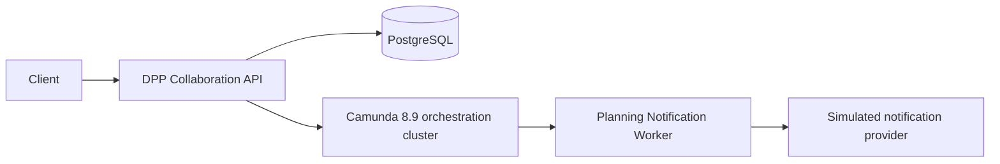

# Architecture

The dependency direction inside the API is `web/infrastructure → application → domain`. Controllers call application use cases; application code depends on `DppReviewRepository`, `CollaborationHistoryRepository`, `CommandLedger`, and `DppReviewWorkflow` ports; JPA and Camunda implement those ports. Domain records contain no Spring, JPA, SQL, Zeebe, task ID, or BPMN activity dependency.

## State ownership

PostgreSQL owns the review business identity, current application lifecycle status, correction versions, comments, dispositions, workflow correlation metadata, and idempotency command records. `PENDING_TO_REVIEW`, `PENDING_MISO_REVIEW`, `REWORK_REQUIRED`, and `COMPLETED` protect application commands; they are deliberately smaller than Camunda's execution state.

Camunda owns process/activity instances, active user tasks, timers, routing, retries, incidents, loops, and execution history. Variables contain only `reviewId`, result/owner identifiers, and routing facts (`toDecision`, `misoDecision`). Comments and dispositions never enter Camunda.

The persisted process instance key is technical correlation, not the review's identity. The Camunda adapter uses the supported 8.9 V2 user-task search filtered by process instance plus expected element ID, requires exactly one active task, then completes it with routing variables.

## Consistency and idempotency

Each command commits its domain mutation and a `BUSINESS_APPLIED` idempotency record in a PostgreSQL transaction, then calls Camunda outside that transaction. Success marks the command `COMPLETED`. Failure remains observable and returns `502`; retrying the same operation, payload, review, and key skips the mutation and retries coordination. Reusing a key for another command/payload returns `409`.

This prevents duplicate corrections/dispositions, but it is not exactly-once workflow delivery. If Camunda accepted a command and the response was lost, task completion retry may find no task. A production design needs a reconciliation/outbox strategy or an engine-supported command/business id; no distributed transaction is claimed.

## Camunda evaluation

Camunda materially provides durable coordination for a multi-day human workflow: persisted tasks, timer scheduling, conditional routing, the rework loop, durable jobs, retry/incident handling, recovery, and Operate visibility. Reimplementing those concerns safely would be substantial.

The application still supplies domain invariants, business persistence/history, REST contracts, an authorization boundary, command idempotency, cross-system recovery policy, task correlation, notification delivery/idempotency, and correlated diagnostics.

Current conclusion: Camunda is promising and likely justified when the DPP collaboration truly remains long-running, timer-heavy, operationally supervised, and changeable. It is not automatically justified for a short CRUD approval. The POC's strongest positive evidence is durable human-task/rework/timer operations; its strongest negative evidence is the unavoidable PostgreSQL/Camunda consistency and reconciliation burden. A production decision should compare expected workflow change/operations volume against the cost of an outbox/reconciler and operating the platform.

## Version evidence and compatibility

Camunda's 8.9 documentation identifies the unified Spring Boot starter as compatible with Spring Boot 4.0.x, `@Deployment` for startup deployment, V2 user-task APIs, and controlled `CamundaError` job failure with retries/backoff. Camunda Run's Docker mode was removed in 8.9, so Compose adapts the official standalone lightweight orchestration topology with H2 secondary storage. The explicit HttpClient 5.6.1 override is retained because it was already required by this repository's resolved starter/Boot combination; it should be re-tested before removal.

The local broker log segment is explicitly reduced to 128 MB using the unified 8.9 image's documented `CAMUNDA_DATA_PRIMARYSTORAGE_LOGSTREAM_LOGSEGMENTSIZE` setting. This is a development compatibility setting: the unified image otherwise preallocates a 1 GiB segment, which prevented startup on a constrained Docker disk. Production sizing must follow Camunda capacity guidance.
